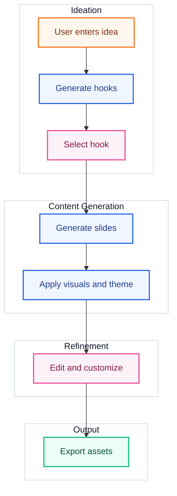
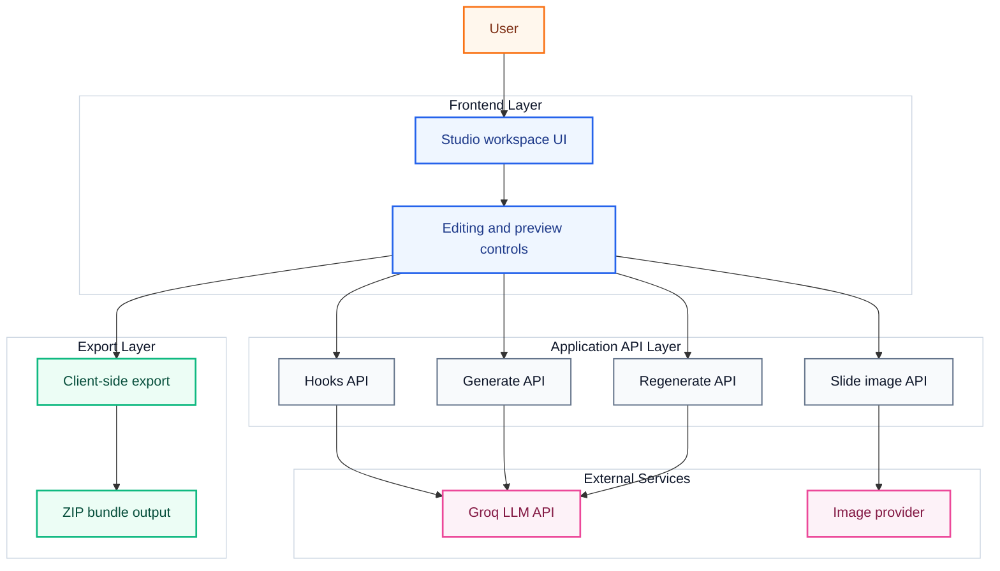

# Social Media Studio

Social Media Studio is a Next.js app for turning a rough content idea into ready-to-post social media creatives. I picked the problem of "content creation takes too long for non-designers" and built a tool that helps users go from topic to editable carousel/post/story slides with AI-assisted hooks, copy, visuals, and export.

## What I Built

The app lets a user:

- enter a topic or idea
- generate 3 hook options
- choose an output format: `carousel`, `post`, or `story`
- generate AI-written slides
- regenerate an individual slide if one part is weak
- customize theme, font, alignment, and padding
- preview the result in a social-style frame
- export the final slides as a ZIP of PNG images

The frontend is built with Next.js App Router and React. The backend uses simple API routes to call LLM/image services and keep the UI flow clean.

## High-Level Design

> Design theme: idea in, polished content out.  
> The product is built as a single creative pipeline where AI handles generation, the user stays in control of editing, and export is the final handoff.

### User Flow



### System View



### HLD Notes

- `Input layer`: the user provides a topic, selects a content format, and optionally chooses an AI-generated hook.
- `Generation layer`: API routes call the LLM to produce hooks, slide copy, and regenerated slide variants.
- `Story engine`: slide count and content structure are controlled by prompt logic based on format like carousel, post, or story.
- `Enhancement layer`: each slide gets a visual prompt and an image source, with a fallback SVG so rendering never fully breaks.
- `Editing layer`: the user can refine titles, body copy, theme, font, alignment, spacing, and preview mode directly in the UI.
- `Export layer`: slides are captured client-side and bundled into downloadable image assets.


## Problem Chosen

I focused on the workflow pain of creating polished social content quickly. A lot of creators and small businesses know what they want to say, but getting from "idea" to "designed post" usually means switching between a writing tool, a design tool, and export steps. This project compresses that into one workspace.

## Key Decisions And Tradeoffs

### 1. Next.js App Router for a single-product workflow

I chose Next.js because it gives a fast path for combining UI and server routes in one codebase. That kept the architecture simple and made it easy to handle generation, regeneration, and image proxying without a separate backend service.

Tradeoff: this is great for a prototype and small product, but for a larger team I would likely separate AI orchestration, analytics, and asset processing into dedicated services.

### 2. Structured JSON responses from the model

The text generation prompts ask for JSON so the UI can directly map model output into editable slides.

Tradeoff: models do not always return perfect JSON, so I added defensive parsing and cleanup logic on the client. That improves resilience, but it also means the frontend is doing some recovery work that could later move server-side.

### 3. Editable slides instead of one-shot exports

I intentionally made the generated content editable in the UI. That keeps the user in control instead of forcing them to accept raw AI output.

Tradeoff: this adds more state management and UI complexity, but it makes the tool much more practical.

### 4. Image fallback handling

Slide visuals are fetched through an API route, and if image generation fails the app returns a fallback SVG. That keeps the product usable even when the external image provider is unavailable.

Tradeoff: fallback visuals are reliable, but less rich than fully generated imagery.

### 5. Client-side export with `html2canvas` and `jszip`

I used client-side rendering/export so users can download slides immediately without waiting on a server-side rendering pipeline.

Tradeoff: this is simple and fast to ship, but export quality and consistency can vary more than a dedicated server-side image renderer.

## Interesting Challenges And How I Solved Them

### Inconsistent AI output formatting

One challenge was that LLM responses are not always perfectly formatted, even when prompted for JSON. To handle that, I added cleanup logic that strips code fences and attempts to extract balanced JSON arrays/objects before parsing. This made generation much more robust.

### Keeping generated text clean

Sometimes model output repeats the topic name or prefixes like "Slide 1". I added text sanitization helpers to remove noisy prefixes so the final slides feel more polished.

### Avoiding total failure when image generation breaks

External image APIs are helpful but not guaranteed. Instead of letting the slide fail visually, I added a fallback SVG response so every slide still renders and exports.

### Supporting multiple content formats in one flow

Carousels, stories, and single posts need different slide counts and aspect ratios. I handled that through one shared UI with format-aware generation and rendering logic rather than building separate flows.

## What I'd Improve With More Time

- move AI parsing/validation fully server-side with stronger schema enforcement
- add authentication and saved projects
- support brand kits with reusable fonts, colors, and logos
- improve export quality with server-side rendering for more consistent outputs
- add drag-and-drop slide reordering
- add richer editing controls like font size, overlay intensity, and image repositioning
- add usage analytics and prompt/version tracking for better iteration
- improve prompt quality per content niche instead of using a broad generic prompt

## Folder Structure

```text
social-media-studio/
|-- app/
|   |-- api/
|   |   |-- generate/route.ts      # Generates slide content
|   |   |-- hooks/route.ts         # Generates hook options
|   |   |-- regenerate/route.ts    # Regenerates one slide
|   |   `-- slide-image/route.ts   # Fetches or falls back for slide images
|   |-- favicon.ico
|   |-- globals.css                # Global styles
|   |-- layout.tsx                 # Root layout
|   `-- page.tsx                   # Main studio UI
|-- public/                        # Static assets
|-- eslint.config.mjs
|-- next.config.ts
|-- package.json
|-- postcss.config.mjs
|-- tsconfig.json
`-- README.md
```

## Local Setup

```bash
npm install
npm run dev
```

Create a `.env.local` file with:

```env
GROQ_API_KEY=your_key_here
```

Then open `http://localhost:3000`.

## Summary

This project is a compact AI-assisted content studio that combines ideation, copy generation, visual generation, customization, preview, and export in one interface. The main goal was to reduce the friction between "I have an idea" and "I have something I can post."
